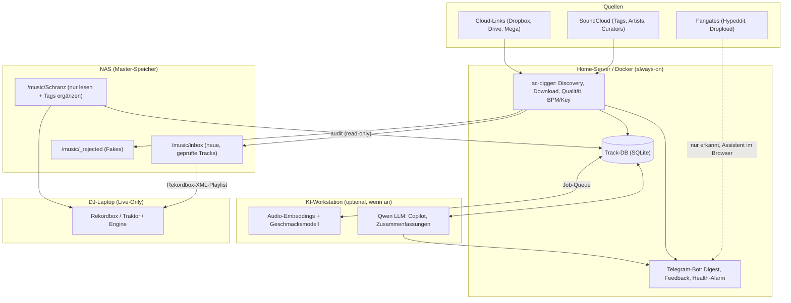

# 🚀 sc-digger – Master-Roadmap & Architektur

Dieses Dokument beschreibt die Gesamtarchitektur und Entwicklungs-Roadmap für das `sc-digger`-Ökosystem.
Ziel ist eine lückenlose, professionelle Pipeline: von der SoundCloud-Suche über Qualitätsprüfung
bis zur fertigen Bereitstellung auf dem DJ-Laptop – ohne die bestehende Sammlung oder die
Rekordbox-Bibliothek zu gefährden.

---

## 🧱 Leitprinzipien

1. **Die Master-Sammlung wird nie destruktiv verändert.** Keine Verschiebungen, Umbenennungen oder
   Audio-Eingriffe im Archiv. Rekordbox/Traktor verknüpfen Cues, Hot Cues und Playlists über den
   Dateipfad – ein verschobener Track verliert sie. Tags werden im Archiv nur ergänzt, nie überschrieben.
2. **Messen statt Verändern.** Lautheit, BPM, Key werden gemessen und als Metadaten gespeichert.
   Auto-Gain der DJ-Software übernimmt den Pegelausgleich.
3. **Fair zu den Artists.** Gates werden erkannt und assistiert, aber nicht umgangen. Öffentlich
   verlinkte Downloads (Cloud-Links, native Downloads) werden automatisch geladen.
4. **Laut scheitern.** Die inoffizielle SoundCloud-API wird irgendwann brechen. Ausfälle müssen
   als Alarm ankommen, nicht als stiller leerer Digest.
5. **Audio vor Text.** Stil- und Geschmacksurteile basieren auf Audio-Embeddings. Das LLM ist
   Dialog- und Zusammenfassungsschicht, nicht das Ohr.

---

## 🏛️ System-Architektur & Rollenverteilung

* **Home-Server (Docker, Cron):** Läuft durchgehend. Discovery, Downloads, Qualitätscheck und
  librosa-Analyse sind leicht genug für den Server. Ein Ausfall der Workstation stoppt den
  täglichen Lauf nicht.
* **KI-Workstation:** Rechenintensives (Embeddings, Qwen) läuft als asynchroner Nachlauf über eine
  Job-Tabelle in der Track-DB, sobald die Workstation an ist. Alles funktioniert auch ohne sie.
* **NAS:** Master-Sammlung (read-mostly) und Inbox.
* **DJ-Laptop:** Keine Hintergrunddienste; neue Tracks kommen als Rekordbox-Playlist an.

---

## 🧭 Entwicklungsphasen im Überblick

| Phase | Fokus | Status | Kernfeatures |
|---|---|---|---|
| **Phase 1** | Basis & DJ-Ready Pipeline | ✅ **Abgeschlossen** | Native Downloads, FFT-Fake-Check, BPM/Key, Tagging, Inbox-Organize, Modi discover/playlist/similar |
| **Phase 1.5** | Robustheit | ✅ **Abgeschlossen** | BPM-Oktav-Korrektur, Health-Alarm |
| **Phase 2** | Track-DB & Library Audit | 🟡 **Fast fertig** | Zentrale DB ✅, `audit` ✅, Fingerprint-Duplikate ✅, LUFS-Tags ✅, Container-Healthcheck ✅, Inbox-Normalisierung ✅ (#74); offen: robuste Discovery (#61), Retry-Queue (#50) |
| **Phase 3** | Feedback & Smart Ingestion | 🟡 **Laufend** | 👍/👎 ✅, Cloud-Downloads ✅, DJ-Sets ✅, Rekordbox-Wochen-XML ✅, Curator-Mining 🟡 (Vorschläge ✅), Cloud-Quellen erweitern ✅, Kaufliste 🟡 (#47), Eingangsordner 🔵 (#70) |
| **Phase 4** | Geschmacksmodell & KI-Copilot | 🔵 Geplant | Audio-Embeddings, persönlicher Taste-Score, Qwen-Copilot via Tool-Calling |
| **Phase 5** | DJ-Performance & Set-Tools | 🟣 Vision | Rekordbox-Cues, Next-Track-Recommender, Web-Dashboard, Stem-Extraktion |

---

## ✅ Phase 1: DJ-Ready Discovery (Abgeschlossen)

- [x] **Drei Modi:** `discover` (Tags + gefolgte Artists), `playlist` (Playlist/Likes gegen Sammlung), `similar` (Related/Track-Radio).
- [x] **Perzentil-Scoring** relativ zur Genre-Baseline statt fixer Like-Ratio.
- [x] **Download-Klassifizierung:** native / Gate (Hypeddit, Droploud, Toneden, Artist Union) / Store / Cloud / nur Stream.
- [x] **Native Download & Quality Check:** `scdl`, ffprobe + FFT-Spektrum-Cutoff gegen Transcodes.
- [x] **BPM- und Camelot-Key-Erkennung** aus dem Audio (`librosa`, Krumhansl-Kessler).
- [x] **Auto-Tagging** (MP3, FLAC, AIFF, M4A) und **Inbox-Organize** nach `inbox/<BPM>/<Key>/`.
- [x] **Telegram-Digest**, gruppiert nach Download-Weg; State-DB gegen Doppelmeldungen; Export-Datei als Anhang.
- [x] **Telegram-Bot:** Playlist- oder Track-Link schicken → volle Liste bzw. Station mit Sammlungsabgleich.
- [x] **Referenz-Accounts:** Reposts/Likes von 28 Schranz-DJs/Labels mit Score-Bonus (Vorstufe zu Curator-Mining).
- [x] **Lautheits-/Clipping-Check** (EBU R128, LRA): Brickwall-Master landen in `_rejected/clipped/`.
- [x] **Nur Original-Downloads** (`--only-original`), mit `SOUNDCLOUD_AUTH_TOKEN` automatisch, sonst verlinkt.

## ✅ Phase 1.5: Robustheit (Abgeschlossen)

- [x] **BPM-Oktav-Korrektur:** Onset-basierte Erkennung springt bei manchem Material auf halbes/doppeltes
  Tempo. Audio-BPM wird per ×2/÷2 ins konfigurierte Fenster geklemmt; Text-BPM des Uploaders dient
  als Plausibilitätsanker.
- [x] **Health-Alarm:** Jeder Lauf wird mit Trefferzahl und Fehlerstatus protokolliert. Telegram-Alarm,
  wenn N Läufe in Folge 0 Treffer liefern oder fehlschlagen (z. B. `client_id` nicht ermittelbar),
  plus Entwarnung, sobald es wieder läuft.

---

## 🔵 Phase 2: Track-DB & Library Audit

Ziel: Ein Index über alle Tracks – neue und bestehende – als Fundament für Duplikaterkennung,
Copilot, Recommender und Dashboard.

### 2.1 Zentrale Track-Datenbank (✅ Implementiert)
- [x] Tabelle `tracks`: Pfad, Audio-Fingerprint, Format/Bitrate, Qualitätsurteil, BPM, Key, LUFS,
  True Peak, Quelle (SoundCloud-URL), Status (inbox/archive/rejected), Feedback.
- [x] Tabelle `jobs`: asynchrone Aufgaben für die Workstation (Embeddings, Beschreibungen).
- [x] Migrationen versioniert, damit die DB über Updates hinweg erhalten bleibt (`schema_migrations`).

### 2.2 `audit`-Befehl (read-only) (✅ Implementiert)
- [x] **Kommando:** `python -m sc_digger.main audit --path /music/Schranz [--report report.html] [--force]`
- [x] **Full-Library Fake-Check:** meldet Transcodes/Upscales in einem interaktiven HTML- und Konsolen-Report. Nichts wird verändert, verschoben oder gelöscht.
- [x] **Index-Aufbau:** füllt die Track-DB mit allen Messwerten (BPM, Key, Cutoff, Bitrate, LUFS, True Peak, LRA).
- [x] **Inkrementell:** bereits erfasste, unveränderte Dateien (mtime + Größe) werden blitzschnell aus dem Cache übernommen.

### 2.3 Duplikate per Audio-Fingerprint (✅ Implementiert)
* Chromaprint (`fpcalc`) ergänzt den Fuzzy-Match auf Dateinamen: findet umbenannte Duplikate und
  unterscheidet echte unterschiedliche Edits.
* Duplikat-Report statt automatischer Löschung.
* Fingerprints der Sammlung in der Track-DB, Report doppelter Aufnahmen im Audit (#42).
* Neue Downloads werden am Klang mit der Sammlung abgeglichen → `_rejected/duplicate/` (#44).

### 2.4 Lautheit messen statt normalisieren (Messen ✅, Inbox-Normalisierung ✅ #74)
* LUFS (EBU R128) und True Peak messen und als Tag speichern (ReplayGain bzw. eigenes Feld).
* Audio im Archiv bleibt unverändert; den Pegelausgleich macht Auto-Gain in Rekordbox/Traktor/Engine.
* Umgesetzt für die Inbox (Issue #74): WAV/AIFF/FLAC samplegenau auf −8,5 LUFS bringen,
  Metadaten byte-identisch. Absenken immer; Anheben nur so weit, wie der Abstand zu −0,5 dBTP
  es ohne Limiter erlaubt. MP3-Global-Gain folgt als eigenes Issue.

---

## 🔵 Phase 3: Feedback & Smart Ingestion

### 3.1 Feedback im Telegram-Digest (✅ Implementiert)
* ~~Inline-Buttons pro Track: 👍 / 👎 / ⏳ „Gate später erledigen".~~
* ~~Bewertungen landen in der Track-DB (`sc_feedback`) und trainieren Scoring-Gewichte und (Phase 4) das Geschmacksmodell.~~

### 3.2 Cloud-Link-Downloader (✅ Implementiert)
* ~~Direkter Download öffentlich verlinkter Dateien: Dropbox (`?dl=1`), Google Drive. ZIP-Archive werden streamend entpackt.~~
* ~~Danach dieselbe Qualitätspipeline wie native Downloads.~~

### 3.3 DJ-Sets erkennen (✅ Implementiert)
* ~~In `discover` werden DJ-Sets automatisch aussortiert; in anderen Modi erscheinen sie im Digest markiert.~~

### 3.4 Rekordbox-XML Wochen-Playlists (✅ Implementiert)
* ~~Nach jedem `discover`-Lauf: `sc-digger.xml` mit Playlist pro Kalenderwoche (`KW xx/yyyy`).~~

### 3.5 Curator-Mining (🟡 Teilweise implementiert, #64)
* ✅ Umgesetzt: `soundcloud.py` (`get_likers`, `get_reposters`), `db.py` (`get_liked_sc_ids`),
  Bot-Befehl `/curator_mining` mit Vorschlagsliste, `config.yaml` → `curator_mining`.
* Offen: Inline-Button „✅ Hinzufügen" (Bot ergänzt `config.yaml`) und wöchentlicher Cron.

Ursprünglicher Plan:
* `soundcloud.py`: `get_likers(track_id)` und `get_reposters(track_id)` über api-v2 (paginiert, konfigurierbar).
* `db.py`: `get_liked_sc_ids()` – alle sc_ids mit `feedback = 'like'`.
* Neuer Modus `curator-mining` in `main.py`: aggregiert Profile über alle 👍-Tracks, filtert bereits bekannte
  (`reference_accounts`, `followed_users`), meldet Kandidaten ab konfigurierbarem Schwellwert.
* **Output:** Telegram-Liste + Inline-Button „✅ Hinzufügen" – Bot ergänzt den Account in `config.yaml`
  (versioniert per Git-Commit möglich, oder nur local).
* **Trigger:** wöchentlich (Cron) **und** auf Zuruf per Bot (`/curator-mining`).
* `config.yaml` → `curator_mining.min_appearances` (default: 2), `curator_mining.max_likers_per_track` (default: 50).

### 3.6 Kaufliste (🟡 In Arbeit, Issue #47 / PR #71)
* Store-Tracks (Bandcamp, Beatport) werden beim Digest in eine neue `store_items`-Tabelle eingetragen
  (sc_id, purchase_url, purchase_title, title, artist, first_seen).
* Wöchentliche Zusammenfassung: Telegram-Nachricht mit allen Store-Tracks, für die noch kein Feedback
  oder `feedback = 'like'` vorliegt.
* **Trigger:** wöchentlich (Cron, Sonntag Abend) **und** Bot-Befehl `/kaufliste`.

### 3.7 Cloud-Quellen erweitern (✅ Implementiert, #66)
* **WeTransfer:** ablaufende Links (7 Tage) werden erkannt und im Digest als „⏳ WeTransfer (läuft ab)"
  markiert; kein automatischer Download.
* **Mega:** clientseitig verschlüsselt → im Digest als „🔒 Mega (manuell)" verlinken.
* **Bandcamp:** Vorschau/Store-Links werden als `STORE` klassifiziert, kein Download.
* `models.py`: ggf. neue `DownloadKind`-Varianten `MEGA`, `WETRANSFER` (oder gemeinsam `MANUAL_CLOUD`).
* Bewusst **nicht** geplant: Umgehung clientseitiger Verschlüsselung, Wegwerf-Adressen, Gate-Bypass
  (Goldene Regel 6 bleibt unverändert).

### 3.8 Eingangsordner für manuell geladene Tracks (🔵 Geplant, Issue #70)
* `inbox/_eingang/`: selbst geladene Dateien (z. B. aus Gates) durchlaufen Fake-Check, Fingerprint-Abgleich,
  BPM/Key, Tags und Sortierung wie native Downloads; Ergebnis im Digest.

---

## 🔵 Phase 4: Geschmacksmodell & KI-Copilot

### 4.1 Audio-Embeddings (Workstation)
* Embeddings über Essentia (Discogs-EffNet / MAEST) oder CLAP, als Job aus der Track-DB.
* Zusätzliche Features: Energie, Perkussions-/Harmonie-Verhältnis, spektrale Rauheit.

### 4.2 Persönlicher Taste-Score (Anti-TikTok-Filter)
* Kleiner Klassifikator: deine Sammlung + 👍 als Positive, 👎 + aussortierte Tracks als Negative.
* Ergänzt das Engagement-Scoring im Digest; filtert Pop-EDM/TikTok-Bounce aus `#hardtechno`
  anhand des Klangs statt anhand von Titeln.
* Nur für Tracks mit verfügbarem Audio (native/Cloud-Downloads) oder über die 30-s-Stream-Preview
  zur Analyse (nicht zur Weitergabe).

### 4.3 Qwen als DJ-Copilot
* Telegram-Dialog: *„Gib mir 3 düstere Tracks aus dem gestrigen Digest über 156 BPM in 5A oder 6A.“*
* Umsetzung über **festes Tool-Calling** (definierte Filter: BPM, Key, Energie, Datum, Taste-Score),
  nicht über frei generiertes SQL.
* Kurzbeschreibungen nur aus belegbaren Merkmalen (Messwerte, Embedding-Nachbarn), keine
  erfundenen Klangdetails.
* Optional: Workstation aus → Bot antwortet ohne LLM mit einfacher Filtersyntax.

---

## 🟣 Phase 5: DJ-Performance & Set-Tools (Vision)

- [x] **Rekordbox-XML-Export:** wöchentliche Playlist „sc-digger KW xx“ aus der Inbox, ohne manuellen Import (siehe 3.4).
- [ ] **Auto-Cue-Points:** Intro-Ende, Drop, Outro-Start als `POSITION_MARK` im Rekordbox-XML / Traktor-NML.
- [ ] **Next-Track-Recommender:** harmonisch (Camelot-Nachbarn), tempomäßig und per Embedding-Ähnlichkeit
  passende Anschlusstracks aus der Sammlung.
- [ ] **Web-Curation-Dashboard:** FastAPI + HTMX zum Vorhören, Bewerten, Sortieren mit Waveform;
  nutzt dieselbe Track-DB und dieselben Feedback-Felder wie Telegram.
- [ ] **Stem-Extraktion via Demucs:** Kicks und Percussion-Loops für 3-Deck-Tools (nur eigene Sammlung).

---

## 📋 Reihenfolge

1. ~~Phase 1.5: BPM-Oktav-Korrektur, Health-Alarm~~ ✅
2. ~~Phase 2.1–2.2: Track-DB, `audit` read-only~~ ✅
3. ~~Phase 2.3–2.4: Fingerprint-Duplikate (DB + Audit), LUFS-Tags~~ ✅
4. ~~Phase 3.1: Feedback-Buttons (Digest + Bot)~~ ✅
5. ~~Phase 3.2–3.4: Cloud-Downloads, DJ-Sets, Rekordbox-Wochen-XML~~ ✅
6. ~~Phase 2.3 Teil 2: Fingerprint-Abgleich beim Download → `_rejected/duplicate/`~~ ✅
7. ~~Phase 3.5 Teil 1: Curator-Mining (Vorschläge per Bot)~~ ✅
8. ~~Phase 3.7: Cloud-Quellen erweitern: WeTransfer/Mega erkennen, Bandcamp als Store~~ ✅
9. **Phase 2 Robustheit:** Discovery bricht bei einzelnen Quellen nicht ab (#61, PR #73) → Retry-Queue (#50)
10. ~~Phase 3.6: Kaufliste (#47, PR #71)~~ ✅ → ~~Inbox-Normalisierung −8,5 LUFS (#74)~~ ✅
11. **Phase 3.8:** Eingangsordner (#70, nach #61 und #50)
12. Phase 4: Embeddings → Taste-Score → Copilot
11. Phase 5: Rekordbox-Cues, Recommender, Dashboard, Stems
