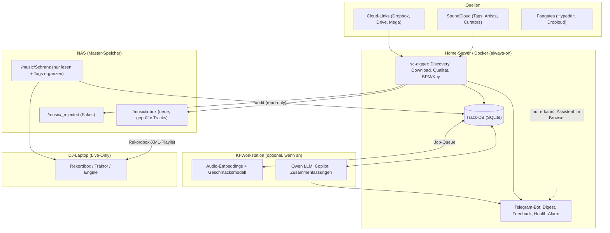

# 🚀 sc-digger – Master-Roadmap & Architektur

Dieses Dokument beschreibt die Gesamtarchitektur und Entwicklungs-Roadmap für das `sc-digger`-Ökosystem.
Ziel ist eine lückenlose, professionelle Pipeline: von der SoundCloud-Suche über Qualitätsprüfung
bis zur fertigen Bereitstellung auf dem DJ-Laptop – ohne die bestehende Sammlung oder die
Rekordbox-Bibliothek zu gefährden.

---

## 🧱 Leitprinzipien

1. **Die Master-Sammlung wird nie destruktiv verändert.** Keine Verschiebungen, Umbenennungen oder
   Audio-Eingriffe im Archiv. Rekordbox/Traktor verknüpfen Cues, Hot Cues und Playlists über den
   Dateipfad – ein verschobener Track verliert sie. Tags werden im Archiv nur ergänzt, nie überschrieben.
2. **Messen statt Verändern.** Lautheit, BPM, Key werden gemessen und als Metadaten gespeichert.
   Auto-Gain der DJ-Software übernimmt den Pegelausgleich.
3. **Fair zu den Artists.** Gates werden erkannt und assistiert, aber nicht umgangen. Öffentlich
   verlinkte Downloads (Cloud-Links, native Downloads) werden automatisch geladen.
4. **Laut scheitern.** Die inoffizielle SoundCloud-API wird irgendwann brechen. Ausfälle müssen
   als Alarm ankommen, nicht als stiller leerer Digest.
5. **Audio vor Text.** Stil- und Geschmacksurteile basieren auf Audio-Embeddings. Das LLM ist
   Dialog- und Zusammenfassungsschicht, nicht das Ohr.

---

## 🏛️ System-Architektur & Rollenverteilung

* **Home-Server (Docker, Cron):** Läuft durchgehend. Discovery, Downloads, Qualitätscheck und
  librosa-Analyse sind leicht genug für den Server. Ein Ausfall der Workstation stoppt den
  täglichen Lauf nicht.
* **KI-Workstation:** Rechenintensives (Embeddings, Qwen) läuft als asynchroner Nachlauf über eine
  Job-Tabelle in der Track-DB, sobald die Workstation an ist. Alles funktioniert auch ohne sie.
* **NAS:** Master-Sammlung (read-mostly) und Inbox.
* **DJ-Laptop:** Keine Hintergrunddienste; neue Tracks kommen als Rekordbox-Playlist an.

---

## 🧭 Entwicklungsphasen im Überblick

| Phase | Fokus | Status | Kernfeatures |
|---|---|---|---|
| **Phase 1** | Basis & DJ-Ready Pipeline | ✅ **Abgeschlossen** | Native Downloads, FFT-Fake-Check, BPM/Key, Tagging, Inbox-Organize, Modi discover/playlist/similar |
| **Phase 1.5** | Robustheit | ✅ **Abgeschlossen** | BPM-Oktav-Korrektur, Health-Alarm |
| **Phase 2** | Track-DB & Library Audit | 🟡 **Nächster Schritt** | Zentrale DB, `audit` read-only, Fingerprint-Duplikate, LUFS als Tag |
| **Phase 3** | Feedback & Smart Ingestion | 🔵 Geplant | 👍/👎 im Digest, Cloud-Link-Downloader, Gate-Assistent, Curator-Mining |
| **Phase 4** | Geschmacksmodell & KI-Copilot | 🔵 Geplant | Audio-Embeddings, persönlicher Taste-Score, Qwen-Copilot via Tool-Calling |
| **Phase 5** | DJ-Performance & Set-Tools | 🟣 Vision | Rekordbox-XML (Playlists, Cues), Next-Track-Recommender, Web-Dashboard |

---

## ✅ Phase 1: DJ-Ready Discovery (Abgeschlossen)

- [x] **Drei Modi:** `discover` (Tags + gefolgte Artists), `playlist` (Playlist/Likes gegen Sammlung), `similar` (Related/Track-Radio).
- [x] **Perzentil-Scoring** relativ zur Genre-Baseline statt fixer Like-Ratio.
- [x] **Download-Klassifizierung:** native / Gate (Hypeddit, Droploud, Toneden, Artist Union) / Store / Cloud / nur Stream.
- [x] **Native Download & Quality Check:** `scdl`, ffprobe + FFT-Spektrum-Cutoff gegen Transcodes.
- [x] **BPM- und Camelot-Key-Erkennung** aus dem Audio (`librosa`, Krumhansl-Kessler).
- [x] **Auto-Tagging** (MP3, FLAC, AIFF, M4A) und **Inbox-Organize** nach `inbox/<BPM>/<Key>/`.
- [x] **Telegram-Digest**, gruppiert nach Download-Weg; State-DB gegen Doppelmeldungen; Export-Datei als Anhang.
- [x] **Telegram-Bot:** Playlist- oder Track-Link schicken → volle Liste bzw. Station mit Sammlungsabgleich.
- [x] **Referenz-Accounts:** Reposts/Likes von 28 Schranz-DJs/Labels mit Score-Bonus (Vorstufe zu Curator-Mining).
- [x] **Lautheits-/Clipping-Check** (EBU R128, LRA): Brickwall-Master landen in `_rejected/clipped/`.
- [x] **Nur Original-Downloads** (`--only-original`), mit `SOUNDCLOUD_AUTH_TOKEN` automatisch, sonst verlinkt.

## ✅ Phase 1.5: Robustheit (Abgeschlossen)

- [x] **BPM-Oktav-Korrektur:** Onset-basierte Erkennung springt bei manchem Material auf halbes/doppeltes
  Tempo. Audio-BPM wird per ×2/÷2 ins konfigurierte Fenster geklemmt; Text-BPM des Uploaders dient
  als Plausibilitätsanker.
- [x] **Health-Alarm:** Jeder Lauf wird mit Trefferzahl und Fehlerstatus protokolliert. Telegram-Alarm,
  wenn N Läufe in Folge 0 Treffer liefern oder fehlschlagen (z. B. `client_id` nicht ermittelbar),
  plus Entwarnung, sobald es wieder läuft.

---

## 🔵 Phase 2: Track-DB & Library Audit

Ziel: Ein Index über alle Tracks – neue und bestehende – als Fundament für Duplikaterkennung,
Copilot, Recommender und Dashboard.

### 2.1 Zentrale Track-Datenbank (✅ Implementiert)
- [x] Tabelle `tracks`: Pfad, Audio-Fingerprint, Format/Bitrate, Qualitätsurteil, BPM, Key, LUFS,
  True Peak, Quelle (SoundCloud-URL), Status (inbox/archive/rejected), Feedback.
- [x] Tabelle `jobs`: asynchrone Aufgaben für die Workstation (Embeddings, Beschreibungen).
- [x] Migrationen versioniert, damit die DB über Updates hinweg erhalten bleibt (`schema_migrations`).

### 2.2 `audit`-Befehl (read-only)
* **Kommando:** `python -m sc_digger.main audit --path /music/Schranz [--report report.html]`
* **Full-Library Fake-Check:** meldet Transcodes/Upscales in einem Report. Nichts wird verschoben.
* **Index-Aufbau:** füllt die Track-DB mit allen Messwerten.
* **Tag-Backfill (opt-in, `--backfill-tags`):** ergänzt nur leere Felder (BPM, Key), überschreibt
  keine vorhandenen Werte (z. B. aus Mixed In Key oder Rekordbox).
* Inkrementell: bereits erfasste, unveränderte Dateien (mtime + Größe) werden übersprungen.

### 2.3 Duplikate per Audio-Fingerprint
* Chromaprint (`fpcalc`) ergänzt den Fuzzy-Match auf Dateinamen: findet umbenannte Duplikate und
  unterscheidet echte unterschiedliche Edits.
* Duplikat-Report statt automatischer Löschung.

### 2.4 Lautheit messen statt normalisieren
* LUFS (EBU R128) und True Peak messen und als Tag speichern (ReplayGain bzw. eigenes Feld).
* Audio im Archiv bleibt unverändert; den Pegelausgleich macht Auto-Gain in Rekordbox/Traktor/Engine.
* Optional und nur für die Inbox: verlustfreies Absenken zu lauter Tracks (MP3-Global-Gain,
  Lossless-Scaling nur nach unten). Kein Anheben, da das bei −0,5 dBTP-Grenze einen Limiter erfordert.

---

## 🔵 Phase 3: Feedback & Smart Ingestion

### 3.1 Feedback im Telegram-Digest
* Inline-Buttons pro Track: 👍 / 👎 / ⬇️ „Gate später erledigen“.
* Bewertungen landen in der Track-DB und trainieren Scoring-Gewichte und (Phase 4) das Geschmacksmodell.

### 3.2 Cloud-Link-Downloader
* Direkter Download öffentlich verlinkter Dateien aus Track-Beschreibungen:
  Dropbox (`?dl=1`), Google Drive, Mega. Danach dieselbe Qualitätspipeline wie native Downloads.

### 3.3 Gate-Assistent (statt Bypass)
* Öffnet das Gate im Browser mit deinem echten Account, trägt Kommentar/Formular vor;
  die letzten Aktionen (Follow, OAuth) bestätigst du selbst.
* E-Mail-Gates mit einer echten Promo-Adresse, die gelesen wird.
* Bewusst **nicht** geplant: Wegwerf-Adressen, Link-Leaks aus dem Seiten-State, Burner-Accounts.
  Gates sind für kleine Producer oft der einzige Weg zu Followern; Umgehung verstößt gegen die ToS
  und bricht bei jeder Frontend-Änderung.

### 3.4 Curator-Mining
* Basis vorhanden: feste Liste `reference_accounts`. Ausbau: Liste automatisch aus 👍-Tracks erweitern.
* Wer deine 👍-Tracks repostet oder liked, kuratiert meist deinen Stil.
* Wöchentliche Vorschläge für `followed_users` aus diesen Profilen, bestätigt per Telegram-Button.

### 3.5 Kaufliste
* Wöchentliche Liste der 👍-Tracks, die nur im Store (Bandcamp, Beatport) verfügbar sind.

---

## 🔵 Phase 4: Geschmacksmodell & KI-Copilot

### 4.1 Audio-Embeddings (Workstation)
* Embeddings über Essentia (Discogs-EffNet / MAEST) oder CLAP, als Job aus der Track-DB.
* Zusätzliche Features: Energie, Perkussions-/Harmonie-Verhältnis, spektrale Rauheit.

### 4.2 Persönlicher Taste-Score (Anti-TikTok-Filter)
* Kleiner Klassifikator: deine Sammlung + 👍 als Positive, 👎 + aussortierte Tracks als Negative.
* Ergänzt das Engagement-Scoring im Digest; filtert Pop-EDM/TikTok-Bounce aus `#hardtechno`
  anhand des Klangs statt anhand von Titeln.
* Nur für Tracks mit verfügbarem Audio (native/Cloud-Downloads) oder über die 30-s-Stream-Preview
  zur Analyse (nicht zur Weitergabe).

### 4.3 Qwen als DJ-Copilot
* Telegram-Dialog: *„Gib mir 3 düstere Tracks aus dem gestrigen Digest über 156 BPM in 5A oder 6A.“*
* Umsetzung über **festes Tool-Calling** (definierte Filter: BPM, Key, Energie, Datum, Taste-Score),
  nicht über frei generiertes SQL.
* Kurzbeschreibungen nur aus belegbaren Merkmalen (Messwerte, Embedding-Nachbarn), keine
  erfundenen Klangdetails.
* Optional: Workstation aus → Bot antwortet ohne LLM mit einfacher Filtersyntax.

---

## 🟣 Phase 5: DJ-Performance & Set-Tools (Vision)

- [ ] **Rekordbox-XML-Export:** wöchentliche Playlist „sc-digger KW xx“ aus der Inbox, ohne manuellen Import.
- [ ] **Auto-Cue-Points:** Intro-Ende, Drop, Outro-Start als `POSITION_MARK` im Rekordbox-XML / Traktor-NML.
- [ ] **Next-Track-Recommender:** harmonisch (Camelot-Nachbarn), tempomäßig und per Embedding-Ähnlichkeit
  passende Anschlusstracks aus der Sammlung.
- [ ] **Web-Curation-Dashboard:** FastAPI + HTMX zum Vorhören, Bewerten, Sortieren mit Waveform;
  nutzt dieselbe Track-DB und dieselben Feedback-Felder wie Telegram.
- [ ] **Stem-Extraktion via Demucs:** Kicks und Percussion-Loops für 3-Deck-Tools (nur eigene Sammlung).

---

## 📋 Reihenfolge

1. ~~Phase 1.5: BPM-Oktav-Korrektur, Health-Alarm~~ ✅
2. Phase 2.1–2.2: Track-DB, `audit` read-only
3. Phase 2.3–2.4: Fingerprint-Duplikate, LUFS als Tag
4. Phase 3.1: Feedback-Buttons
5. Phase 3.2–3.5: Cloud-Links, Gate-Assistent, Curator-Mining, Kaufliste
6. Phase 4: Embeddings → Taste-Score → Copilot
7. Phase 5: Rekordbox-XML, Recommender, Dashboard, Stems
